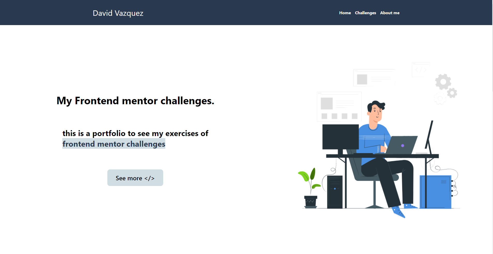
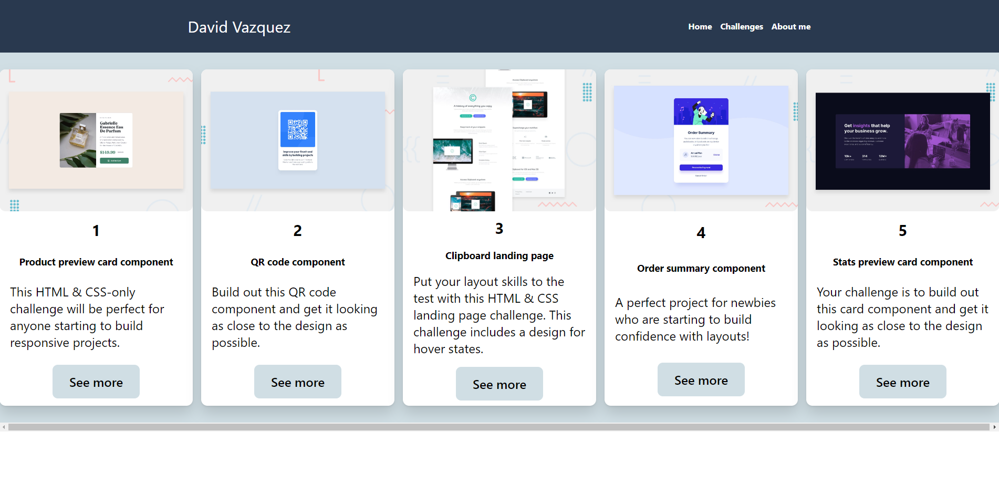

# Frontend-Mentor-challenges
En este repositorio agregare mis retos cumplidos de frontend mentor challenges que principalmente los hago para poder practicar mi habilidad con html y css. 

para estra pagina se utilizo [GitHub Pages](https://daveoval.github.io/Frontend-Mentor-challenges/) para el despliegue

